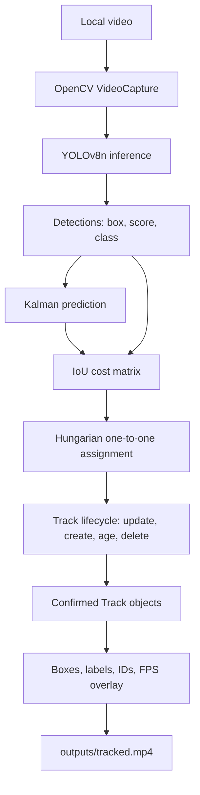

# multi-object-track


**A compact computer-vision pipeline that combines pretrained Ultralytics YOLO detection with a transparent Kalman-filter and Hungarian-assignment tracker.**

The project processes a local video frame by frame, assigns persistent integer IDs to detected objects, and writes an annotated MP4 containing boxes, class labels, confidence scores, IDs, FPS, and active-track counts. It demonstrates the separation between **per-frame detection** and **temporal association** without requiring model training or a GPU.

## What I Built

- Integrated a pretrained `yolov8n.pt` detector through the Ultralytics Python API.
- Implemented a constant-velocity Kalman filter for box prediction.
- Implemented IoU-based one-to-one matching with SciPy's Hungarian algorithm.
- Added configurable track confirmation and stale-track deletion.
- Added deterministic ID colors and an annotated video output.
- Added focused unit tests for matching, lifecycle, invalid inputs, and rendering fallbacks.
- Documented a real detector failure on an openly licensed public video.

## Why It Matters

Object detection answers "what is in this frame?" Tracking adds temporal identity: "is this the same object I saw in the previous frames?" Stable IDs support counting, trajectory analysis, line crossing, movement analytics, and many surveillance, traffic, robotics, sports, and industrial-vision workflows.

This is an educational baseline, not a production surveillance system. It intentionally favors understandable engineering over a large tracking framework.

## Architecture



### Runtime workflow

1. OpenCV reads one frame; the full video is never loaded into memory.
2. YOLO predicts bounding boxes, confidence scores, and class IDs.
3. Each existing track predicts its next box with a Kalman filter.
4. Predicted boxes and detections are compared with IoU.
5. Hungarian assignment chooses a global one-to-one pairing; low-IoU and cross-class pairs are rejected.
6. Matched tracks receive a measurement update, unmatched detections create new IDs, and stale tracks are removed.
7. Confirmed current tracks are drawn and written to the output video.

YOLO is responsible for detection. The custom tracker is responsible for temporal association and IDs.

## Technical Highlights

- **State estimation:** 8D state `[center_x, center_y, width, height, vx, vy, vwidth, vheight]`.
- **Association:** Hungarian assignment minimizes `1 - IoU` with a configurable IoU gate.
- **Track lifecycle:** `min_hits` suppresses transient tracks; `max_age` retains internal state through brief missed detections.
- **Defensive boundaries:** malformed boxes, invalid scores, invalid class IDs, CLI ranges, and missing input videos produce clear errors.
- **Resource handling:** OpenCV capture and writer are released even when writer initialization fails after capture opens.
- **Portable entry point:** `python -m src.main` is the recommended command; the original `python src/main.py` form remains supported.
- **Testability:** core tracking uses synthetic detections, so tests do not need to run YOLO.

## Technologies

| Area | Technology |
|---|---|
| Language | Python 3.10+ |
| Detector | Ultralytics YOLOv8n pretrained weights |
| Video I/O and drawing | OpenCV |
| Numerical operations | NumPy |
| Assignment solver | SciPy `linear_sum_assignment` |
| Testing | pytest |
| Input example | W3C-hosted Blender Foundation Sintel trailer, CC BY 3.0 |

## Project Structure

```text
multi-object-track/
├── README.md                 # Public project guide
├── LICENSE                   # MIT license
├── requirements.txt          # Runtime and test dependencies
├── .gitignore                # Local environments, media, weights, and personal notes
├── src/
│   ├── __init__.py
│   ├── main.py               # CLI and frame-processing loop
│   ├── detector.py           # Ultralytics adapter
│   ├── tracker.py            # Kalman + IoU + Hungarian tracker
│   ├── visualization.py      # Boxes, labels, colors, status overlay
│   └── utils.py              # Video validation and writer setup
├── data/
│   └── README.md             # Public input source and download instructions
├── outputs/
│   └── .gitkeep              # Keeps the output directory visible
└── tests/
    └── test_tracker.py       # Deterministic tracker tests
```

Generated input/output media, model weights, virtual environments, and the personal `analysis.md` guide are ignored and should not be committed.

## Installation

Python 3.10 or newer is recommended. The verified local run used Python 3.13 on CPU.

### Windows PowerShell

```powershell
python -m venv .venv
.\.venv\Scripts\Activate.ps1
python -m pip install -r requirements.txt
```

If PowerShell blocks activation for the current terminal, use:

```powershell
Set-ExecutionPolicy -Scope Process -ExecutionPolicy RemoteSigned
.\.venv\Scripts\Activate.ps1
```

### Windows Command Prompt

```bat
python -m venv .venv
.venv\Scripts\activate.bat
python -m pip install -r requirements.txt
```

### Linux/macOS

```bash
python3 -m venv .venv
source .venv/bin/activate
python -m pip install -r requirements.txt
```

Ultralytics downloads `yolov8n.pt` on first use if the model is not already present. CPU execution is supported; a configured GPU can be used automatically by Ultralytics.

## Input Video

The project accepts any local video that OpenCV can decode. The documented example is the W3C-hosted Blender Foundation Sintel trailer, distributed under CC BY 3.0. See [data/README.md](data/README.md) for source and download details.

Download the example on Windows:

```powershell
Invoke-WebRequest `
  -Uri "https://media.w3.org/2010/05/sintel/trailer.mp4" `
  -OutFile data/input.mp4
```

Or provide a video you are permitted to process:

```text
python -m src.main --input path/to/video.mp4 --output outputs/tracked.mp4
```

The repository intentionally does not commit video files.

## Run the Demo

From the repository root, the recommended cross-platform command is:

```text
python -m src.main --input data/input.mp4 --output outputs/tracked.mp4
```

Equivalent direct-script execution remains available:

```text
python src/main.py --input data/input.mp4 --output outputs/tracked.mp4
```

The program prints the processed frame count, average detector/tracker FPS, maximum active confirmed tracks, and output path. The resulting file is `outputs/tracked.mp4`.

## Configuration

| Argument | Default | Valid values / meaning |
|---|---:|---|
| `--input` | required | Existing local video path |
| `--output` | `outputs/tracked.mp4` | Output video path |
| `--model` | `yolov8n.pt` | Ultralytics model name or local weights path |
| `--confidence` | `0.35` | Detector confidence in `[0, 1]` |
| `--iou-threshold` | `0.3` | Association IoU gate in `[0, 1]` |
| `--max-age` | `15` | Non-negative missed frames retained internally |
| `--min-hits` | `3` | Positive matches needed to display a track |

Examples:

```text
python -m src.main --input data/input.mp4 --output outputs/tracked.mp4 --confidence 0.4
python -m src.main --input data/input.mp4 --model yolov8s.pt --max-age 20 --min-hits 2
```

### Tuning guidance

- Raise `--confidence` to reduce weak/false detections, at the risk of more missed objects.
- Lower `--confidence` to improve recall, at the risk of noisier tracks.
- Lower `--iou-threshold` for faster or less-overlapping motion, at the risk of incorrect matches.
- Raise `--max-age` for longer detector gaps, at the risk of retaining stale state.
- Raise `--min-hits` to suppress one-frame false tracks, at the cost of delayed confirmation.

## Results

The figures below come from an earlier local run on the W3C Sintel trailer (`data/input.mp4`). The input video, annotated output, and model weights are not in this repository, so these numbers were not recomputed from committed files and are not a fresh measurement.

| Measurement | Result |
|---|---:|
| Frames processed | 1,253 |
| Resolution | 854 x 480 |
| Video rate | 24 FPS |
| Detector/tracker processing rate | 10.76 FPS on CPU |
| Maximum active confirmed tracks | 3 |
| Tracker tests reported by that run | 8 passed |

The reported 10.76 FPS is from that earlier local run. It measures detection and tracking work only. It excludes frame decoding, annotation drawing, and video encoding, so it should not be presented as complete end-to-end throughput.

That run reported 8 passing tests. `tests/test_tracker.py` currently defines nine test functions, including CLI validation of tracker settings. The suite was not re-run when this repository was prepared, so the earlier pass count is not a current verification.

### Observed failure case

The inspected output showed a dragon-like CGI creature labeled as `ID: 47 | bird` around frame 651. This is a detector domain-shift failure: the pretrained COCO detector was not trained for the visual appearance and semantic categories of this synthetic scene.

Around frame 901, a small distant person had no active track. The detector likely failed to produce a sufficiently confident or well-localized box, so the tracker had no usable measurement to associate. A stronger or domain-fine-tuned detector, higher input resolution, lower-confidence recovery, or an appearance-based tracker could help. These are proposed improvements, not implemented claims.

## Testing

Run the deterministic tests without needing the input video or model weights:

```powershell
.venv\Scripts\python.exe -m pytest tests/test_tracker.py -q
```

The suite covers:

- IoU calculation.
- ID persistence during movement.
- Track removal after `max_age`.
- One-to-one Hungarian matching.
- Delayed confirmation through `min_hits`.
- Class-aware matching.
- Invalid bounding-box rejection.
- Safe rendering when a class ID is outside a list of labels.
- CLI rejection of invalid confidence, IoU, max-age, and min-hits settings.

## Limitations

- Association uses motion and IoU, not visual appearance or Re-ID embeddings.
- Long occlusions, similar objects crossing, and camera movement can cause ID switches.
- Missed detections can fragment tracks or create a new ID after deletion.
- Missed tracks are retained internally but are not drawn during the missed frames.
- The detector is pretrained and not fine-tuned for drone, surveillance, or Sintel imagery.
- No formal MOTA, MOTP, IDF1, or HOTA results are reported because the repository has no ground-truth annotations.
- The current benchmark measures only detector/tracker processing time.
- The public sample is a demonstration input, not a representative deployment dataset.

## Future Improvements

1. Evaluate on an annotated MOT or drone-specific dataset with MOTA, IDF1, HOTA, ID switches, and fragmentation.
2. Compare the baseline against ByteTrack and BoT-SORT.
3. Add appearance embeddings or DeepSORT-style Re-ID for difficult crossings and occlusions.
4. Add camera-motion compensation for moving or aerial cameras.
5. Add optional predicted-box rendering during short missed intervals.
6. Benchmark larger/newer YOLO models and hardware acceleration.
7. Package the CLI with a standard Python entry point and add CI on supported Python versions.

## Troubleshooting

### `ModuleNotFoundError` for project modules

Run the command from the repository root and prefer:

```text
python -m src.main --input data/input.mp4 --output outputs/tracked.mp4
```

### Model download fails

Check network access, or download a compatible Ultralytics model separately and pass its local path:

```text
python -m src.main --input data/input.mp4 --model path/to/yolov8n.pt
```

### Input video cannot be opened

Confirm the path exists, that the file is a real video, and that the local OpenCV build supports its codec. Try the documented MP4 sample first.

### Processing is slow

CPU inference is expected to be slower than playback for this configuration. Use a smaller input, a nano model, a configured GPU, or process fewer frames for a quick demonstration.

### Output writer cannot be opened

Use an output directory you can write to and an extension supported by the local OpenCV build. The default `mp4v` writer produces `outputs/tracked.mp4`.

### PowerShell activation is blocked

Use the process-scoped execution-policy command in the installation section, or invoke `.venv\Scripts\python.exe` directly without activating the environment.

## Suggested Reading Order

1. **Architecture:** Start with the diagram above and the split between per-frame detection and temporal association.
2. **Tracker:** Read `src/tracker.py` for the 8D Kalman state, IoU matrix, Hungarian assignment, and lifecycle rules.
3. **Run:** `python -m src.main --input data/input.mp4 --output outputs/tracked.mp4`.
4. **Output:** A local `outputs/tracked.mp4` shows persistent ID, class, and confidence labels plus the status banner. That annotated video is generated locally and is not committed.
5. **Design choice:** YOLO supplies observations. The classical tracker supplies temporal association, which keeps that boundary explicit.
6. **Tests:** `python -m pytest tests/test_tracker.py -q` exercises matching, lifecycle, invalid inputs, rendering fallbacks, and CLI validation. The Results section records what an earlier local run reported.
7. **Limitations:** CGI false classification, the missed distant person, no Re-ID, no camera-motion compensation, and a partial FPS measurement.
8. **Next steps:** Formal annotated evaluation and a ByteTrack or BoT-SORT comparison before treating the baseline as robust.


## Security and Repository Hygiene

- No API keys, tokens, passwords, or credentials are required.
- Local videos, model weights, generated outputs, virtual environments, caches, and `analysis.md` are ignored.
- Do not upload private or sensitive video without authorization and appropriate privacy review.
- Review Ultralytics licensing terms before redistributing or deploying the dependency in a commercial product.
- The Sintel sample source and CC BY 3.0 information are documented in [data/README.md](data/README.md).

## Project Information

This is a small learning project on practical computer vision and classical multi-object tracking. It does not claim a deployed system or a formal tracking benchmark.

## License and Attribution

The code in this repository is released under the MIT License. Copyright (c) 2026 Suleman Qamar. See [LICENSE](LICENSE).

The Sintel trailer is not included. Its source and CC BY 3.0 terms are documented in [data/README.md](data/README.md). Ultralytics has its own license, which is separate from this repository's MIT license.
